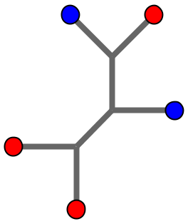
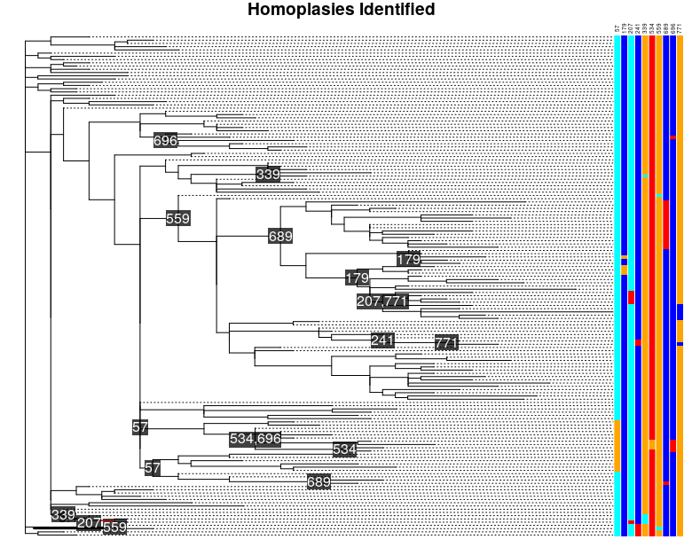

<br/>

# HomoplasyFinder 
## Author: Joseph Crispell
## Licence: GPL-3
## Requires: R (>= v3.3.3) & Java (>= v10.0.1)

<br/><br/>

## Description
*HomoplasyFinder* is an open-source tool designed to identify homoplasies on a phylogeny and its nucleotide alignment. *HomoplasyFinder* uses the [consistency index](https://watermark.silverchair.com/20-4-406.pdf?token=AQECAHi208BE49Ooan9kkhW_Ercy7Dm3ZL_9Cf3qfKAc485ysgAAAk0wggJJBgkqhkiG9w0BBwagggI6MIICNgIBADCCAi8GCSqGSIb3DQEHATAeBglghkgBZQMEAS4wEQQMKSQ_nllVEDic-YzoAgEQgIICAIXBcXqLAIsF7BibuGViKKBTLwDT88vDxzLfUFEk041b4hGCT6yhF4Rm373_OzyumpTIcv7TdM0DA_OlXHiabyW5hhHPpxOmWeFVirFd7cMgJVIzjdIg1-2jXM1KQt1NcrkcvjPyiGfjfCBSn-F4k4vM16Y6-G-nkCnf8P4uBeYsgd8u7P604gEFqDg4VuU2cxBQKCB0FlfzG_QTCvK8lZlaaVoEUvN4o4Yv2BRC8qmYaf2lyqVF1x-eozlFB-OZvhQ9q1pxT1UNgevok5KgEpJsvTZ-rQtnBhfS6APumiF-eMqrrse4mbmmmmqcGYqz8h_iLnuBoU7JGQIYKlWyMXlyZLI7nRJGiieh002RnE8-OWcJGSaUI-yGENekJjpcaDBRF6sw4TrJC5jOcTXQfnYy-gxTjxA0Rgo_7MG28C90gVa5r3uovmEEsbzE7lYx8GiYOneLEAO0y1fdv7yvB9wCNO5ZKffitZanV0Tf-SHnWomGtw7fzzZc2QP_8wqer-00Sh6_M78g4LO1ErZdaQBP-Bfziidg8vXwmsM5ydo1uVNb5enqk5E_9yKkEjOU7lvLwLIBXU-G47F2UvZ7KAm3ka5Bc4xf8FuDcRsqZzGwJYHG-ZcVlI69JgN9NvYqbpv2xV0vjlLa524hnynz6pZn5J1bgUX9B75LRYUTVOrJ) to identify sites in the nucleotide alignment that are inconsistent with the phylogeny provided. The current R package was written to allow easy use of the Java code (which *HomoplasyFinder* uses) in R. Full documentation is provided on the [HomoplasyFinder wiki](https://github.com/JosephCrispell/homoplasyFinder/wiki).

## Installation
```
install.packages("devtools")
library("devtools")
install_github("JosephCrispell/homoplasyFinder")
install_github("JosephCrispell/addTextLabels") # Makes annotated plotted phylogeny prettier :-)
library(homoplasyFinder)
```

## Executing
```
# Find the FASTA and tree files attached to package
fastaFile <- system.file("extdata", "example.fasta", package = "homoplasyFinder")
treeFile <- system.file("extdata", "example.tree", package = "homoplasyFinder")

# Run the HomoplasyFinder jar tool
inconsistentPositions <- runHomoplasyFinderInJava(treeFile=treeFile, 
                                                  fastaFile=fastaFile, 
                                                  path=workingDirectory)
 
# Get the current date
date <- format(Sys.Date(), "%d-%m-%y")

# Get the current working directory
workingDirectory <- paste0(getwd(), "/")
 
# Read in the output table
resultsFile <- paste0(workingDirectory, "consistencyIndexReport_", date, ".txt")
results <- read.table(resultsFile, header=TRUE, sep="\t", stringsAsFactors=FALSE)
 
# Read in the annotated tree
tree <- readAnnotatedTree(workingDirectory)
 
# Plot the annotated tree
plotAnnotatedTree(tree, inconsistentPositions, fastaFile)
```
You should get the following plot:<br>


## Citation
If you use *HomoplasyFinder* in your research, it would be great if you could cite the following article:
Crispell, J., Balaz, D., & Gordon, S. V. (2019). HomoplasyFinder: a simple tool to identify homoplasies on a phylogeny. Microbial Genomics. [https://doi.org/10.1099/mgen.0.000245](https://doi.org/10.1099/mgen.0.000245)

## Now extended to deal with the presence/absence of INDELs
*HomoplasyFinder* can now calculate the consistency of INDELs (or any regions) on a phylogeny. To do this simply replace the FASTA file with a CSV formatted table reporting the presence/absence of regions. Here is an example of a format:
```
start,end,isolateA,isolateB,isolateC
34802,35208,0,1,0
39068,39069,0,0,1
```

Test it out using the following:
```
# Find the FASTA and tree files attached to package
presenceAbsenceFile <- system.file("extdata", "presenceAbsence_INDELs.csv", package = "homoplasyFinder")
treeFile <- system.file("extdata", "example.tree", package = "homoplasyFinder")

# Run the HomoplasyFinder jar tool
inconsistentPositions <- runHomoplasyFinderInJava(treeFile=treeFile, 
                                                  presenceAbsenceFile=presenceAbsenceFile, 
                                                  path=workingDirectory)
 
# Get the current date
date <- format(Sys.Date(), "%d-%m-%y")

# Get the current working directory
workingDirectory <- paste0(getwd(), "/")
 
# Read in the output table
resultsFile <- paste0(workingDirectory, "consistencyIndexReport_", date, ".txt")
results <- read.table(resultsFile, header=TRUE, sep="\t", stringsAsFactors=FALSE)
```
